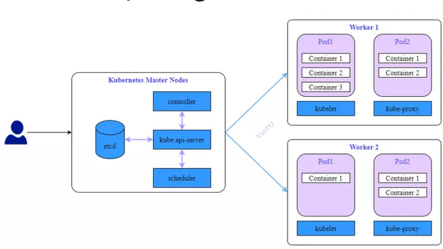

# Báo cáo cài cụm K8S
## Mục lục
- [Tiêu đề](#báo-cáo-cài-cụm-k8s)
- [Mục lục](#mục-lục)
- [K8S là gì](#k8s-là-gì)
- [Kiến trúc K8S](#kiến-trúc-k8s)
- [Cài đặt cụm K8S](#cài-đặt-một-cụm-k8s)

## K8S là gì ?
K8S là một tool open-source được phát triển bở google giúp quản lý và tự động hóa công việc ở trên nhiều nền tảng khác nhau như on-premise, cloud.
## Kiến trúc K8S

Hệ thống Kubernetes gồm 2 phần chính là Control Plane(Hay còn gọi là Master Node) và Data Plane(Hay còn gọi là Worker Node). Master Node thì đóng vai trò xử lý các tác vụ quản lý, điều khiển hệ thống còn Worker Node là nơi xử lý các work load của hệ thống. Các pod được tạo và chạy trên các Worker Node.

Thành phần chính của Master Node bao gồm 4 thành phần:
- etcd: etcd là một cơ sở dữ liệu dạng key-value có tính khả dụng và đồng nhất cao. Etcd là nơi K8S lưu trữ toàn bộ các thông tin cấu hình của hệ thống.
- controller: là một tiến trình chạy nền trên các Master Node. Các tiến trình này chạy liên tục để điều tiết trạng thái của hệ thống Kubernetes. Trong K8S, controller là một vòng lặp điều khiển giám sát trạng thái của cluster được chia sẻ qua các api và thực hiện các thay đổi cần thiết để chuyển trạng thái của cluster tới trạng thái mong muốn.
- kube api-sever: Đây là core của K8S Master, nó mở ra các HTTP API cho phép người dùng cuối cũng như các thành phần khác nhau trong chính K8S cluster trao đổi thông tin với nhau. K8S API cho phép người dùng lấy thông tin về trạng thái của các đối tượng trong hệ thống như Pods, Namespaces, Services ... Hầu hết các tác vụ sử dụng kube-api thông qua lệnh kubectl nhưng cũng có thể gọi trực tiếp REST API
- kube-scheduler: Đây là service mặc định của K8S là nhiệm vụ phân phối Pod sẽ được chạy trên node nào. Mỗi Container bên trong Pod có thể có những yêu cầu khác nhau, hoặc ngay các Pod cũng có yêu cầu khác nhau. Do đó nhiệm vụ của Sceduler là tìm kiếm các node thỏa mãn các điều kiện trên và lựa chọn node tối ưu nhất để chạy. Trong trường hợp không có node nào thỏa mãn các điệu kiện đặt ra thì Pod sẽ ở trạng thái chưa được lên lịch thực thi cho tới khi Scheduler tìm được node phù hợp.

Về Worker Node sẽ có các thành phần chính bao gồm:
- kubelet: Nó đóng vai trò như "Node Agent" của K8S trên các Worker Node. Nhiệm vụ của nó để Worker Node được đăng ký và quản lý bở cụm K8S cũng như là nhận nhiệm vụ triển khai các Pod (thường thông qua kube api-sever) và đảm bảo các container đó được chạy ổn định. Lưu ý là kubelete không quản lý các container không được tạo bởi Kubernetes
- kube-proxy: kube-proxy là một network proxy chạy trên mỗi node trong K8S cluster, thực hiện một phần Kubernetes Service. Kube-proxy duy trì network rules trên các node. Những network rules này cho phép kết nối mạng đến các pods từ trong hoặc ngoài cluster.

## Cài đặt một cụm K8S
**_Phần này được viết lại theo tài liệu hướng dẫn của anh Tiến_**

### Version
    Ubuntu: 20.04
    Kubeflow:v1.7.0
    Kubernetes: v1.25
### Prerequisites(Điều kiện tiên quyết)
    Kubernetes v1.25
    Kustomize v5.0.3
    Kubectl
    A default StorageClass (Provisioner is rook ceph)
    For each node, attach at least 2 empty hard disk (ask proxmox maintainer to prepare)

### Cluster Information
    Haproxy: admin
    Master Node 1: 10.17.35.8 || ceph-osd-1
    Worker Node 1: 10.17.35.9 || ceph-osd-2
    Worker Node 2: 10.17.35.10 || ceph-osd-3
### Khuyến nghị:
Nên cài và đăng nhập docker trên masternode trước khi cài đặt cụm K8S, cách cài đặt như sau:

    _ 1.Set up Docker's apt repository. _
    # Add Docker's official GPG key:
    sudo apt-get update
    sudo apt-get install ca-certificates curl gnupg
    sudo install -m 0755 -d /etc/apt/keyrings
    curl -fsSL https://download.docker.com/linux/ubuntu/gpg | sudo gpg --dearmor -o /etc/apt/keyrings/docker.gpg
    sudo chmod a+r /etc/apt/keyrings/docker.gpg

    # Add the repository to Apt sources:
    echo \
    "deb [arch=$(dpkg --print-architecture) signed-by=/etc/apt/keyrings/docker.gpg] https://download.docker.com/linux/ubuntu \
    $(. /etc/os-release && echo "$VERSION_CODENAME") stable" | \
    sudo tee /etc/apt/sources.list.d/docker.list > /dev/null
    sudo apt-get update
    _ 2.Install the Docker packages. _
    sudo apt-get install docker-ce docker-ce-cli containerd.io docker-buildx-plugin docker-compose-plugin
    _ 3.Login docker. _
    sudo docker login #add user name and password
### Install kube-tools,Install Cri-O Container Runtime,Start Cri-O Service,Disable Swap and Edit Network for all node (masternode, workernode1,     workernode2)
#### Install kube-tools
    sudo apt-get update
    sudo apt-get install -y apt-transport-https ca-certificates curl
    # Ubuntu 20.04 doesn't have keyrings dir by default
    sudo mkdir -m 755 /etc/apt/keyrings
    sudo curl -fsSLo /etc/apt/keyrings/kubernetes-archive-keyring.gpg https://packages.cloud.google.com/apt/doc/apt-key.gpg
    echo "deb [signed-by=/etc/apt/keyrings/kubernetes-archive-keyring.gpg] https://apt.kubernetes.io/ kubernetes-xenial main" | sudo tee /etc/apt/sources.list.d/kubernetes.list
    curl -s https://packages.cloud.google.com/apt/doc/apt-key.gpg | sudo apt-key add - && \
    echo "deb http://apt.kubernetes.io/ kubernetes-xenial main" | sudo tee /etc/apt/sources.list.d/kubernetes.list && \
    sudo apt-get update -q
    # To get information about all available version
    # apt list -a kubectl
    sudo apt-get install -qy kubelet=1.25.14-00 kubectl=1.25.14-00 kubeadm=1.25.14-00
    sudo apt-mark hold kubelet kubeadm kubectl
#### Install Cri-O Container Runtime
    OS=xUbuntu_20.04
    # Cri-O version should match k8s version
    CRIO_VERSION=1.25
    echo "deb https://download.opensuse.org/repositories/devel:/kubic:/libcontainers:/stable/$OS/ /"|sudo tee /etc/apt/sources.list.d/devel:kubic:libcontainers:stable.list
    echo "deb http://download.opensuse.org/repositories/devel:/kubic:/libcontainers:/stable:/cri-o:/$CRIO_VERSION/$OS/ /"|sudo tee /etc/apt/sources.list.d/devel:kubic:libcontainers:stable:cri-o:$CRIO_VERSION.list
    curl -L https://download.opensuse.org/repositories/devel:/kubic:/libcontainers:/stable:/cri-o:/1.23/xUbuntu_20.04/Release.key | sudo apt-key add -
    curl -L https://download.opensuse.org/repositories/devel:/kubic:/libcontainers:/stable/$OS/Release.key | sudo apt-key add -
    sudo apt-get update
    sudo apt-get install cri-o cri-o-runc -y
#### Start Cri-O Service
    sudo systemctl start crio
    sudo systemctl enable crio
#### Disable Swap
    sudo swapoff -a
#### Edit Network
    sudo modprobe overlay
    sudo modprobe br_netfilter
    sudo tee /etc/sysctl.d/kubernetes.conf<<EOF
    net.bridge.bridge-nf-call-iptables = 1
    net.ipv4.ip_forward = 1
    EOF
    sudo sysctl --system
### Kubeadm Init, Install Calico Pod Network Add-on, Create New Token for Worker Node to Join only on MasterNode
#### Kubeadm Init
    su # enter root, use "sudo passwd root" to change password of root
    sudo systemctl enable kubelet
    sudo kubeadm config images pull --cri-socket unix:///var/run/crio/crio.sock
    # Change apiserver-advertise-address to Master Node IP
    sudo kubeadm init --pod-network-cidr=192.168.0.0/16 --apiserver-advertise-address=10.17.35.8 --cri-socket unix:///var/run/crio/crio.sock
    # Save `kubeadm join ...` for Worker Node
    exit # exit root
    mkdir -p $HOME/.kube
    sudo cp -i /etc/kubernetes/admin.conf $HOME/.kube/config
    sudo chown $(id -u):$(id -g) $HOME/.kube/config
#### Install Calico Pod Network Add-on
    kubectl apply -f https://projectcalico.docs.tigera.io/manifests/calico.yaml
#### Create New Token for Worker Node to Join
    # Create new token
    kubeadm token generate
    # Get discovery-token-ca-cert-hash
    openssl x509 -pubkey -in /etc/kubernetes/pki/ca.crt | openssl rsa -pubin -outform der 2>/dev/null | openssl dgst -sha256 -hex | sed 's/^.* //'
    # kubeadm token create <generated-token> --print-join-command --ttl=0
    # change "kofdh1.rmk4z7xeblw85qe0" with the new token created at the first step
    kubeadm token create kofdh1.rmk4z7xeblw85qe0 --print-join-command --ttl=0
### On Worker node, replace token with the one from step Kubeadm Init at Master Node
    su # enter root, use "sudo passwd root" to change password of root
    # kubeadm join __IP__MASTER__ --token __ABOVE__TOKEN__ --discovery-token-ca-cert-hash sha256:__ABOVE__SHA256__
    sudo systemctl enable kubelet
    # replace token with the one from step Kubeadm Init at Master Node
    kubeadm join 10.17.35.242:6443 --token kofdh1.rmk4z7xeblw85qe0 \
            --discovery-token-ca-cert-hash sha256:66618de30ab1d7461dbdece670458b4be3ef50397bf8b49440a6cf4068723d24 --cri-socket unix:///var/run/crio/crio.sock

From here, all installation will be on Master Node.

### Rook-Ceph
#### Taint Master Node so it can be scheduled
    # replace `ceph-osd-1` with the name of Master Node
    kubectl taint node ceph-osd-1 node-role.kubernetes.io/control-plane-
#### Install Rook-Ceph Operator
    git clone --single-branch --branch v1.12.9 https://github.com/rook/rook.git
    cd rook/deploy/examples
    kubectl create -f crds.yaml -f common.yaml -f operator.yaml
#### Configure rook/deploy/examples/cluster.yaml
    # uncomment this line if attached disk size is smaller than 100GB
    databaseSizeMB: "1024"
    # change ssl: true to ssl: false in dashboard
    dashboard:
        ssl: false
#### Deploy Cluster
    # cd rook/deploy/examples
    kubectl create -f cluster.yaml
#### Create Storage Class
    # cd rook/deploy/examples/csi/rbd/
    kubectl create -f storageclass.yaml
#### Make rook-storage-class Default
    kubectl patch sc rook-ceph-block -p '{"metadata":{"annotations":{"storageclass.kubernetes.io/is-default-class":"true"}}}'

After installing as above, please wait (it may take about 8 hours depending on the hardware). You can use the command 'watch kubectl get pod -A' to check if all pods are running.

### Kubeflow
#### Install kustomize v5.0.3
    wget "https://github.com/kubernetes-sigs/kustomize/releases/download/kustomize%2Fv5.0.3/kustomize_v5.0.3_linux_amd64.tar.gz"
    tar -zxvf kustomize_v5.0.3_linux_amd64.tar.gz
    sudo chmod +x kustomize
    sudo mv kustomize /usr/local/bin/kustomize
    rm kustomize_v5.0.3_linux_amd64.tar.gz
#### Clone kubeflow manifest 1.7.0
    git clone -b v1.7.0 https://github.com/kubeflow/manifests.git
#### Set Secure Cookies Off
    Set JWA_APP_SECURE_COOKIES=false in file apps/jupyter/jupyter-web-app/upstream/base/params.env
    Set TWA_APP_SECURE_COOKIES=false in file apps/tensorboard/tensorboards-web-app/upstream/base/params.env
    Set VWA_APP_SECURE_COOKIES=false in file kubeflow-manifest-1.6.1/apps/volumes-web-app/upstream/base/params.env
    Add APP_SECURE_COOKIES=false in literals in configMapGenerator in file contrib/kserve/models-web-app/base/kustomization.yaml
    Add APP_SECURE_COOKIES=false in literals in configMapGenerator in file contrib/kserve/models-web-app/overlays/kubeflow/kustomization.yaml
### Set Istio-Ingressgateway to use NodePort instead of ClusterIP
    # manifests/common/istio-1-17/istio-install/base/patches/service.yaml
    apiVersion: v1
    kind: Service
    metadata:
        name: istio-ingressgateway
        namespace: istio-system
    spec:
        type: NodePort
### Set Storage Class Name (in case there are 2 default Storage Classes)
Add storageClassName: rook-ceph-block like this:

    ---
    apiVersion: v1
    kind: PersistentVolumeClaim
    metadata:
        name: katib-mysql
        namespace: kubeflow
    spec:
        storageClassName: rook-ceph-block
        accessModes:
            - ReadWriteOnce
        resources:
            requests:
                storage: 10Gi

to these files:

    apps/katib/upstream/components/mysql/pvc.yaml
    apps/pipeline/upstream/third-party/minio/base/minio-pvc.yaml
    apps/pipeline/upstream/third-party/mysql/base/mysql-pv-claim.yaml
    common/oidc-authservice/base/pvc.yaml

### Install Individual Components 
#### Install cert-manager:
    kustomize build common/cert-manager/cert-manager/base | kubectl apply -f -
    kubectl wait --for=condition=ready pod -l 'app in (cert-manager,webhook)' --timeout=180s -n cert-manager
    kustomize build common/cert-manager/kubeflow-issuer/base | kubectl apply -f -
#### Install Istio:
    kustomize build common/istio-1-16/istio-crds/base | kubectl apply -f -
    kustomize build common/istio-1-16/istio-namespace/base | kubectl apply -f -
    kustomize build common/istio-1-16/istio-install/base | kubectl apply -f -
#### Install Dex:
    kustomize build common/dex/overlays/istio | kubectl apply -f -
#### OIDC AuthService:
    kustomize build common/oidc-authservice/base | kubectl apply -f -
#### Install Knative Serving:
    kustomize build common/knative/knative-serving/overlays/gateways | kubectl apply -f -
    kustomize build common/istio-1-16/cluster-local-gateway/base | kubectl apply -f -

Optionally, you can install Knative Eventing which can be used for inference request logging:

    kustomize build common/knative/knative-eventing/base | kubectl apply -f -
#### Install kubeflow namespace:
    kustomize build common/kubeflow-namespace/base | kubectl apply -f -
#### Install kubeflow roles:
    kustomize build common/kubeflow-roles/base | kubectl apply -f -
#### Install istio resources:
    kustomize build common/istio-1-16/kubeflow-istio-resources/base | kubectl apply -f -
#### Install the Multi-User Kubeflow Pipelines official Kubeflow component:
    kustomize build apps/pipeline/upstream/env/cert-manager/platform-agnostic-multi-user | awk '!/well-defined/' | kubectl apply -f -

Do not use the deprecated and insecure PNS executor anymore

    kustomize build apps/pipeline/upstream/env/platform-agnostic-multi-user-pns | kubectl apply -f -
#### Install the KServe component:
    kustomize build contrib/kserve/kserve | kubectl apply -f -
#### Install the Models web app:
    kustomize build contrib/kserve/models-web-app/overlays/kubeflow | kubectl apply -f -
#### Install the Katib official Kubeflow component:
    kustomize build apps/katib/upstream/installs/katib-with-kubeflow | kubectl apply -f -
#### Install the Central Dashboard official Kubeflow component:
    kustomize build apps/centraldashboard/upstream/overlays/kserve | kubectl apply -f -
#### Install the Admission Webhook for PodDefaults:
    kustomize build apps/admission-webhook/upstream/overlays/cert-manager | kubectl apply -f -
#### Install the Notebook Controller official Kubeflow component:
    kustomize build apps/jupyter/notebook-controller/upstream/overlays/kubeflow | kubectl apply -f -
#### Install the Jupyter Web App official Kubeflow component:
    kustomize build apps/jupyter/jupyter-web-app/upstream/overlays/istio | kubectl apply -f -
#### Install the Profile Controller and the Kubeflow Access-Management (KFAM) official Kubeflow components:
    kustomize build apps/profiles/upstream/overlays/kubeflow | kubectl apply -f -
#### Volumes Web App
    kustomize build apps/volumes-web-app/upstream/overlays/istio | kubectl apply -f -
#### Install the Tensorboards Web App official Kubeflow component:
    kustomize build apps/tensorboard/tensorboards-web-app/upstream/overlays/istio | kubectl apply -f -
#### Install the Tensorboard Controller official Kubeflow component:
    kustomize build apps/tensorboard/tensorboard-controller/upstream/overlays/kubeflow | kubectl apply -f -
#### Install the Training Operator official Kubeflow component:
    kustomize build apps/training-operator/upstream/overlays/kubeflow | kubectl apply -f -
#### Finally, create a new namespace for the the default user (named kubeflow-user-example-com).
    kustomize build common/user-namespace/base | kubectl apply -f -

After installation, it will take some time for all Pods to become ready. Make sure all Pods are ready before trying to connect, otherwise you might get unexpected errors. To check that all Kubeflow-related Pods are ready, use the following commands:

    kubectl get pods -n cert-manager
    kubectl get pods -n istio-system
    kubectl get pods -n auth
    kubectl get pods -n knative-eventing
    kubectl get pods -n knative-serving
    kubectl get pods -n kubeflow
    kubectl get pods -n kubeflow-user-example-com

or:
    watch kubectl get pod -A

After All Pods Are Running Get Istio Service

    kubectl get svc istio-ingressgateway -n istio-system
    # istio-ingressgateway   NodePort   10.98.248.196   <none>        15021:32052/TCP,80:31749/TCP,443:31059/TCP,31400:30495/TCP,15443:30672/TCP   13m
    # -> port 31749
    # -> access through browser with url
    # 10.17.35.242:31749
With This Port, You can Access Kubeflow By SSH -L From Your Machine

    ssh -L 31749:localhost:31749 k8s-m1
    # Access through browser with url
    # localhost:30856

### Use Haproxy to Expose Kubeflow
    ssh admin
    sudo nano /etc/haproxy/haproxy.cfg

Add These Lines to The Bottom of haproxy.cfg
    frontend kubeflow-iamtienng
        bind *:31749
        mode tcp
        use_backend kubeflow-iamtienng

    backend kubeflow-iamtienng
        mode tcp
        server kubeflow-iamtienng 10.17.35.242:31749 check

Test Haproxy Config

    haproxy -c -f /etc/haproxy/haproxy.cfg

Restart Haproxy

    sudo systemctl restart haproxy
Access through Browser With URL

    admin:31749

### Appendix
Maybe sometime you need to restart core-dns

    kubectl rollout restart -n kube-system deployment/coredns

